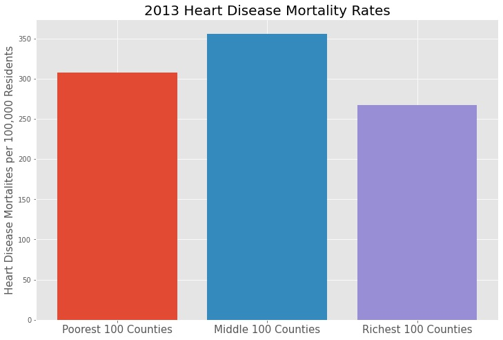

# **Predicting Heart Disease Mortality**

## **Background**

Heart disease mortality rates vary significatly across different counties and states within the United States. I set out to explore what could cause these differences by combining data provided by the government health data website, the US Census Bureau, and the National Oceanic and Atmospheric Administration (NOAA). 

---

## **Dataset**
The data includes values for each year from 2013-2018. During my exploratory data analysis I discovered that changes in time did not significantly change the outcomes of any of my hypothesis tests so I mainly focused on using data from a single year. 

### **Sources:**

Government Healthcare Data - 
[Dataset](https://healthdata.gov/dataset/Heart-Disease-Mortality-Data-Among-US-Adults-35-by/pwn5-iqp5)

The U.S. Census Bureau - 
[Dataset](https://data.census.gov/cedsci/table?t=Income%20and%20Earnings&g=0100000US.050000&y=2017&tid=ACSST1Y2017.S1901&hidePreview=true)

The National Oceanic and Atmospheric Administration (NOAA) - 
[Dataset](https://www.ncdc.noaa.gov/cag/county/mapping/110/pcp/201601/12/value)

### **Key Features:**

|Feature Name     |Data type |Source |Description                              |
|-------------------|-----------|---------|-------------------------------------------------|
| Data_Value    | Float      | Government Healthcare Data | Number of heart disease mortalities per 100k residents of county 1
| LocationDesc              | String      | Government Healthcare Data, U.S. Census Data| County name
| LocationAbbr             | String      | Government Healthcare Data, U.S. Census Data | Abbreviation of State 
| LocationID             | Integer      | Governnment Healthcare Data, U.S. Census Data | This is a unique number given to each county in the U.S. to identify it
|   Households!!Estimate!!Mean income (dollars)            | Float      | U.S. Census Data  | An Estimate of the mean household income for each county
| Location | String      | NOAA | Name of the County
| Location ID      | String      | NOAA | This is a unique number given to each county in the U.S. to identify it 2
| Value     | Float      | NOAA | The mean temperature in the county for the given year

1This value is per 100,000 residents, spacially smoothed over 3 years, and age-adjusted. [Age-adjusted](https://en.wikipedia.org/wiki/Age_adjustment) is medical definition that attempts to adjust the value so that differences in the age of a population between counties will not skew the value.   

2The NOAA Location ID column was not in the same format as the Governement Healthcare Data and U.S. Census data but I was able to use part of this string to merge the different datasets based on county name and the state name (which was pulled from the Location ID column).

### **Notes About the Data**
* I want to reiterate the footnote1 up above. Because this data has been age-adjusted we can assume that varying aged populations between counties will not affect the values. 

* There were a total of 3,104 rows for each dataset while there are 3,143 counties in the U.S. if you do not include counties in Puerto Rico. This difference is because I chose to ignore counties that had missing values. These missing values mainly came from counties with not enough residents to accurately estimate the mortality rate per 100,000 residents. 

---

## **Exploratory Data Analysis**
Once I combined all of the data into a single dataframe I could then look to see if there were any significant features may be affecting the heart disease mortality rate for each county.

### **Exploration of Temperature feature**

Th first step in comparing the temperature data to the mortality rate was to normalize the data using a [min/max normalization](https://en.wikipedia.org/wiki/Feature_scaling#Rescaling_(min-max_normalization)). I was then able to plot the two features on the same axis as shown below.

---

---

As you can see there appears to be some correlation between the two but this graph makes it a little unclear how strong that correlation may be. Also note that the large jumps in the graph are caused by moving between states. This would lead me to believe that what state a county in is affecting the graph more than the temperature. In order to be able to directly compare the affect of temperature on each the heart disease mortalities of each county, I decided to break the counties up into two groups. I put counties who's temperature was above the mean temperature across counties into a data frame named "hot_counties" and then put the counties below the mean temperature in a data frame named "cold_counties". The scatter plot below shows the difference in the two data frames. 

---

---

The key things I took away from this graph were that the warm counties tended to have a larger range of values and that the difference in the two means was quite large.

From these graphs I was able to see that temperature may be an important factor when in comes to heart disease mortality rates. Because of these findings I will use temperature in my hypothesis testing later. 

### **Exploration of Income Feature**

The first step in exploring the income feature was to order the data by the mean household income feature. By doing this I could then plot the mortality rate with an x-axis of increasing income per county as shown below.

---

---

The trend in this graph is clear that lower income counties have a significantly higher rate of heart disease mortality. In counties where the mean household income is above $80,000 there are very few data points that fall above the overall mean mortality rate while a majority of counties falling below a $50,000 mean household income were above the overall mean mortality rate. 

To take this a step further let's look at the means of the 100 richest, 100 middle, and the 100 poorest counties. We'll define the richest and poorest counties by the mean household income for this example.

---

---

This made it clear that mean household income was certainly a feature worth exploring more. **The difference between the mean of the 100 poorest counties and the 100 richest counties was 209.2 mortalities per 100,000. If these means are truely representitive of the entire population than we can estimate that people in rich counties are 44% less likely to die from heart disease than those in poor counties.** In order to see if this data is significant I will conduct a hypothesis test on these features.

---

### **The Curious Case of Franklin Parish, Louisiana** 

    
While most of the health data tended to fall into a mostly normal distrubution, there was one county that clearly was an outlier. Franklin Parish is a mostly rural county in Louisiana where the heart disease mortality rate was 1071.6 per 100,000 residents. This is over double the country-wide mean of 361.9 and is 265.2 higher the next highest county, Caldwell Parish, which is also in Louisiana.

I am not the only one who found this interesting as there is currently a study underway at LSU’s Pennington Biomedical Research Center which features Franklin Parish due to the county's high rate of heart disease mortalities. More information about the study can be found [here](https://www.pbrc.edu/news/media/2019/RURAL-Study-Announced-Why-do-Some-but-Not-All-Rural-Southerners-Live-longer-Healthier-Lives.aspx).

Because this outlier is so extreme, I've chosen to ignore this data point in my hypothesis testing.

## **Hypothesis Testing**

### **Temperature**

### **Income**

## **Conclusions**

### **Usability**

### **Future Exploration**

